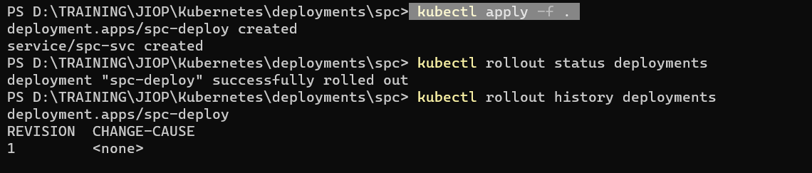
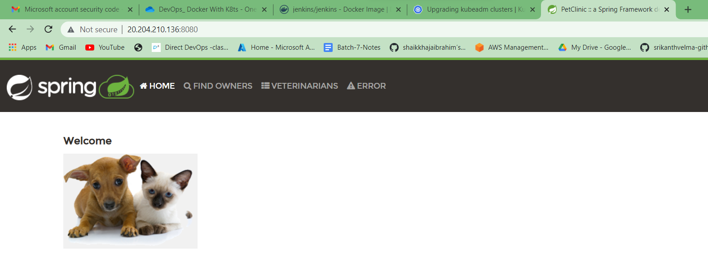
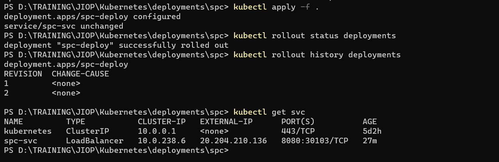
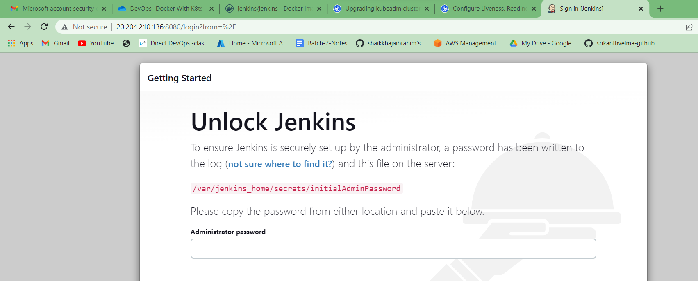
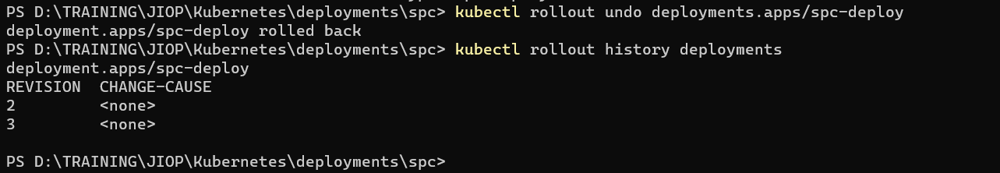
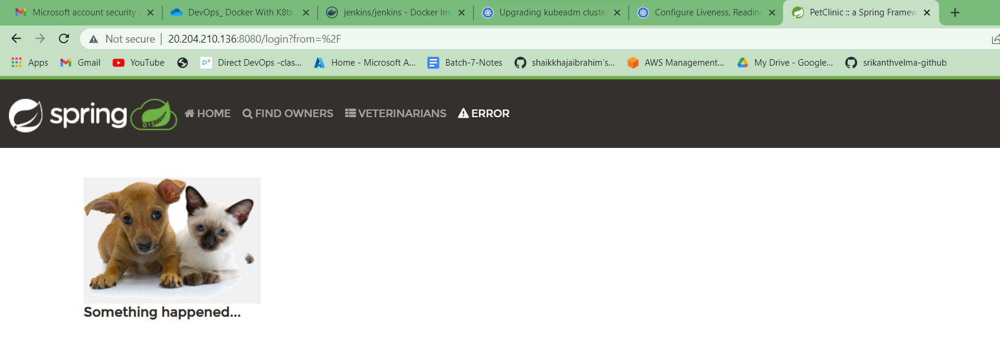

# kubernetes
JIOP-09-05-2023
---------------
```
Create a Kubernetes cluster using kubeadm
Deploy any application using kubectl
Backup Kubernetes I.e backup etcd
List out all the pod’s running in kube system namespace
Write down all the steps required to make Kubernetes highly available
Do a rolling update and roll back
Ensure usage of secret in MySQL and configmaps
Create a nop commerce deployment with MySQL statefulset and nop deployment
```
### 1. Create a Kubernetes cluster using kubeadm
* task already on 260423
### 2. Deploy any application using kubectl
* task done on 260423
### 3. Backup Kubernetes i.e backup etcd
* [referhere][https://k21academy.com/docker-kubernetes/etcd-backup-restore-in-k8s-step-by-step/]
### 4. List out all the pod’s running in kube system namespace
### 5. Write down all the steps required to make Kubernetes highly available
* [referhere][https://kubernetes.io/docs/setup/production-environment/tools/kubeadm/ha-topology/#external-etcd-topology]
### 6. Do rollout and rollback
* Creating a spc deployment with loadbalncer service
  * spc-deploy
  * spc-svc
```sh
kubectl apply -f .         # spc app with spc image
kubectl rollout status deployments
kubectl rollout history deployments
```


* now to test `rollout` , changing the spc image to jenkins image


* now to `rollback` to spc
```sh
kubectl rollout undo deployments.apps/spc-deploy
```
* by doing this it again cam back spc page
* NOTE: this is not ideal way , we only change the version of same application
*  not different application
*  To understand ourself i have taken 2 different applications




#### Doubts
* nop and mysql config
* terraform mysql
* etcd backup - got one reference but not sure about it , need to take clarity
* liveness - http ot tcpscoket not succeded
* how to check memory of nodes
* can we connect to nodes by ssh

