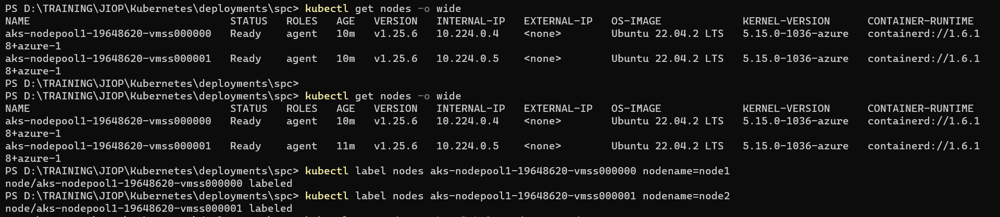
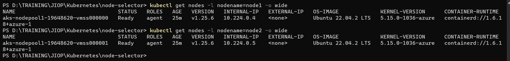
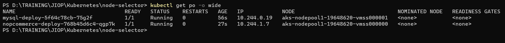
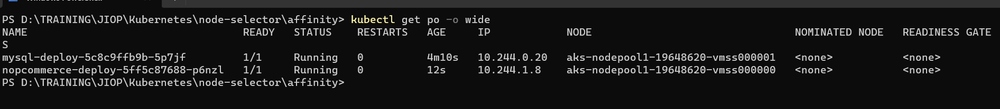
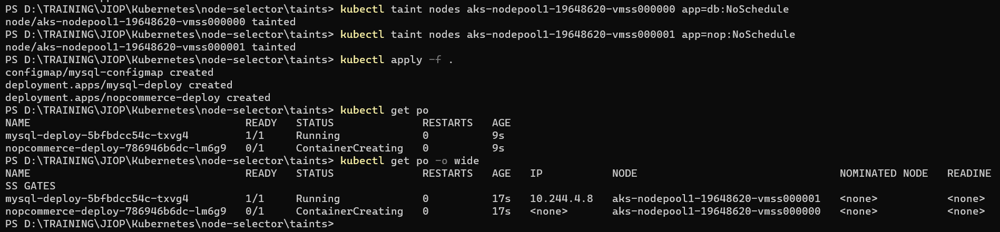

#### 1.Create 1 master node and 2 worker nodes – run app on node1 and db on node2 by using 
#### a.	Node selector 
#### b.	Affinity 
#### c.	Taints and tolerances 

* creating aks cluster with 2 nodes
* added labels for nodes as node1 and node2


* write manifest files for one app to select `node1`
* and one db to select `node2`

* nop
```yaml
---
apiVersion: apps/v1
kind: Deployment
metadata:
  name: nopcommerce-deploy
spec:
  minReadySeconds: 60
  replicas: 1
  selector:
    matchLabels:
      app: nop
  strategy:
    type: RollingUpdate
    rollingUpdate:
      maxSurge: 25%
      maxUnavailable: 25%
  template:
    metadata:
      name: nop-pod
      labels:
        app: nop
    spec:
      nodeSelector:
        nodename: node1
      containers:
        - name: nop-ctnr
          image: srikanthvelma/nopcommerce:v1.0
          ports:
            - containerPort: 5000
              protocol: TCP
          env:
            - name: ConnectionStrings__WebAppContext
              value: "server=mysql-svc;uid=root;pwd=rootroot;database=employees"
            - name: MYSQL_SERVER
              value: mysql-stateful-0.mysql-svc
```
* mysql
```yaml
---
apiVersion: apps/v1
kind: Deployment
metadata:
  name: mysql-deploy
spec:
  minReadySeconds: 5
  replicas: 1
  selector:
    matchLabels:
      app: mysql
  strategy:
    type: RollingUpdate
    rollingUpdate:
      maxSurge: 25%
      maxUnavailable: 25%
  template:
    metadata:
      name: mysql-pod
      labels:
        app: mysql
    spec:
      nodeSelector:
        nodename: node2
      containers:
        - name: mysql-ctnr
          image: mysql:8
          ports:
            - containerPort: 3306
          envFrom:
            - configMapRef:
                name: mysql-configmap
                optional: false  
```
#### Affinity

* nop
```yaml
---
apiVersion: apps/v1
kind: Deployment
metadata:
  name: nopcommerce-deploy
spec:
  minReadySeconds: 60
  replicas: 1
  selector:
    matchLabels:
      app: nop
  strategy:
    type: RollingUpdate
    rollingUpdate:
      maxSurge: 25%
      maxUnavailable: 25%
  template:
    metadata:
      name: nop-pod
      labels:
        app: nop
    spec:
      affinity:
        nodeAffinity:
          requiredDuringSchedulingIgnoredDuringExecution:
            nodeSelectorTerms:
              - matchExpressions:
                  - key: nodename
                    operator: In
                    values: 
                      - node1
      containers:
        - name: nop-ctnr
          image: srikanthvelma/nopcommerce:v1.0
          ports:
            - containerPort: 5000
              protocol: TCP
          env:
            - name: ConnectionStrings__WebAppContext
              value: "server=mysql-svc;uid=root;pwd=rootroot;database=employees"
            - name: MYSQL_SERVER
              value: mysql-stateful-0.mysql-svc
```
* mysql
```yaml
---
apiVersion: apps/v1
kind: Deployment
metadata:
  name: mysql-deploy
spec:
  minReadySeconds: 5
  replicas: 1
  selector:
    matchLabels:
      app: mysql
  strategy:
    type: RollingUpdate
    rollingUpdate:
      maxSurge: 25%
      maxUnavailable: 25%
  template:
    metadata:
      name: mysql-pod
      labels:
        app: mysql
    spec:
      affinity:
        nodeAffinity:
          requiredDuringSchedulingIgnoredDuringExecution:
            nodeSelectorTerms:
              - matchExpressions:
                  - key: nodename
                    operator: In
                    values: 
                      - node2
      containers:
        - name: mysql-ctnr
          image: mysql:8
          ports:
            - containerPort: 3306
          envFrom:
            - configMapRef:
                name: mysql-configmap
                optional: false
```
#### Taints and tolerences
* first we have to attach taints to nodes
* `kubectl taint nodes <node-name> <key=value:effect>`
```sh
kubectl taint nodes aks-node-65756001 app=db:NoSchedule
kubectl taint nodes aks-node-65756002 app=web:NoSchedule
```
* create a manifest by writing tolerences in it
* here taints are opposite to selector, if we observe in above example
* if tolerence of app=db matches - it will not schedule in this machine
* nop
```yaml
---
apiVersion: apps/v1
kind: Deployment
metadata:
  name: nopcommerce-deploy
spec:
  minReadySeconds: 60
  replicas: 1
  selector:
    matchLabels:
      app: nop
  strategy:
    type: RollingUpdate
    rollingUpdate:
      maxSurge: 25%
      maxUnavailable: 25%
  template:
    metadata:
      name: nop-pod
      labels:
        app: nop
    spec:
      tolerations:
        - key: app
          operator: Equal
          value: db
          effect: NoSchedule
      containers:
        - name: nop-ctnr
          image: srikanthvelma/nopcommerce:v1.0
          ports:
            - containerPort: 5000
              protocol: TCP
          env:
            - name: ConnectionStrings__WebAppContext
              value: "server=mysql-svc;uid=root;pwd=rootroot;database=employees"
            - name: MYSQL_SERVER
              value: mysql-stateful-0.mysql-svc
```
* mysql
```yaml
---
apiVersion: apps/v1
kind: Deployment
metadata:
  name: mysql-deploy
spec:
  minReadySeconds: 5
  replicas: 1
  selector:
    matchLabels:
      app: mysql
  strategy:
    type: RollingUpdate
    rollingUpdate:
      maxSurge: 25%
      maxUnavailable: 25%
  template:
    metadata:
      name: mysql-pod
      labels:
        app: mysql
    spec:
      tolerations:
        - key: app
          operator: Equal
          value: nop
          effect: NoSchedule
      containers:
        - name: mysql-ctnr
          image: mysql:8
          ports:
            - containerPort: 3306
          envFrom:
            - configMapRef:
                name: mysql-configmap
                optional: false
```
