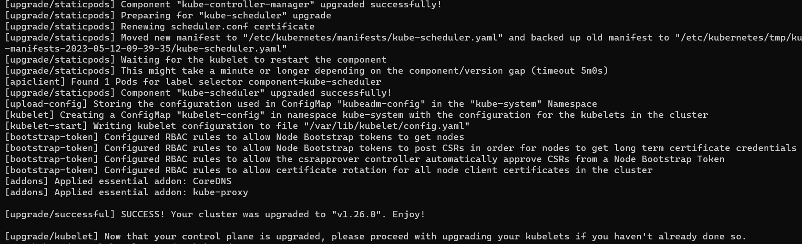
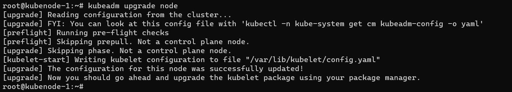

#### 1.Create 1 master node and 2 worker nodes – run app on node1 and db on node2 by using 
#### a.	Node selector 
#### b.	Affinity 
#### c.	Taints and tolerances 

* creating aks cluster with 2 nodes
* added labels for nodes as node1 and node2


* write manifest files for one app to select `node1`
* and one db to select `node2`

* nop
```yaml
---
apiVersion: apps/v1
kind: Deployment
metadata:
  name: nopcommerce-deploy
spec:
  minReadySeconds: 60
  replicas: 1
  selector:
    matchLabels:
      app: nop
  strategy:
    type: RollingUpdate
    rollingUpdate:
      maxSurge: 25%
      maxUnavailable: 25%
  template:
    metadata:
      name: nop-pod
      labels:
        app: nop
    spec:
      nodeSelector:
        nodename: node1
      containers:
        - name: nop-ctnr
          image: srikanthvelma/nopcommerce:v1.0
          ports:
            - containerPort: 5000
              protocol: TCP
          env:
            - name: ConnectionStrings__WebAppContext
              value: "server=mysql-svc;uid=root;pwd=rootroot;database=employees"
            - name: MYSQL_SERVER
              value: mysql-stateful-0.mysql-svc
```
* mysql
```yaml
---
apiVersion: apps/v1
kind: Deployment
metadata:
  name: mysql-deploy
spec:
  minReadySeconds: 5
  replicas: 1
  selector:
    matchLabels:
      app: mysql
  strategy:
    type: RollingUpdate
    rollingUpdate:
      maxSurge: 25%
      maxUnavailable: 25%
  template:
    metadata:
      name: mysql-pod
      labels:
        app: mysql
    spec:
      nodeSelector:
        nodename: node2
      containers:
        - name: mysql-ctnr
          image: mysql:8
          ports:
            - containerPort: 3306
          envFrom:
            - configMapRef:
                name: mysql-configmap
                optional: false  
```
#### Affinity

* nop
```yaml
---
apiVersion: apps/v1
kind: Deployment
metadata:
  name: nopcommerce-deploy
spec:
  minReadySeconds: 60
  replicas: 1
  selector:
    matchLabels:
      app: nop
  strategy:
    type: RollingUpdate
    rollingUpdate:
      maxSurge: 25%
      maxUnavailable: 25%
  template:
    metadata:
      name: nop-pod
      labels:
        app: nop
    spec:
      affinity:
        nodeAffinity:
          requiredDuringSchedulingIgnoredDuringExecution:
            nodeSelectorTerms:
              - matchExpressions:
                  - key: nodename
                    operator: In
                    values: 
                      - node1
      containers:
        - name: nop-ctnr
          image: srikanthvelma/nopcommerce:v1.0
          ports:
            - containerPort: 5000
              protocol: TCP
          env:
            - name: ConnectionStrings__WebAppContext
              value: "server=mysql-svc;uid=root;pwd=rootroot;database=employees"
            - name: MYSQL_SERVER
              value: mysql-stateful-0.mysql-svc
```
* mysql
```yaml
---
apiVersion: apps/v1
kind: Deployment
metadata:
  name: mysql-deploy
spec:
  minReadySeconds: 5
  replicas: 1
  selector:
    matchLabels:
      app: mysql
  strategy:
    type: RollingUpdate
    rollingUpdate:
      maxSurge: 25%
      maxUnavailable: 25%
  template:
    metadata:
      name: mysql-pod
      labels:
        app: mysql
    spec:
      affinity:
        nodeAffinity:
          requiredDuringSchedulingIgnoredDuringExecution:
            nodeSelectorTerms:
              - matchExpressions:
                  - key: nodename
                    operator: In
                    values: 
                      - node2
      containers:
        - name: mysql-ctnr
          image: mysql:8
          ports:
            - containerPort: 3306
          envFrom:
            - configMapRef:
                name: mysql-configmap
                optional: false
```
#### Taints and tolerences
* first we have to attach taints to nodes
* `kubectl taint nodes <node-name> <key=value:effect>`
```sh
kubectl taint nodes aks-node-65756001 app=db:NoSchedule
kubectl taint nodes aks-node-65756002 app=web:NoSchedule
```
* create a manifest by writing tolerences in it
* here taints are opposite to selector, if we observe in above example
* if tolerence of app=db matches - it will not schedule in this machine
* nop
```yaml
---
apiVersion: apps/v1
kind: Deployment
metadata:
  name: nopcommerce-deploy
spec:
  minReadySeconds: 60
  replicas: 1
  selector:
    matchLabels:
      app: nop
  strategy:
    type: RollingUpdate
    rollingUpdate:
      maxSurge: 25%
      maxUnavailable: 25%
  template:
    metadata:
      name: nop-pod
      labels:
        app: nop
    spec:
      tolerations:
        - key: app
          operator: Equal
          value: db
          effect: NoSchedule
      containers:
        - name: nop-ctnr
          image: srikanthvelma/nopcommerce:v1.0
          ports:
            - containerPort: 5000
              protocol: TCP
          env:
            - name: ConnectionStrings__WebAppContext
              value: "server=mysql-svc;uid=root;pwd=rootroot;database=employees"
            - name: MYSQL_SERVER
              value: mysql-stateful-0.mysql-svc
```
* mysql
```yaml
---
apiVersion: apps/v1
kind: Deployment
metadata:
  name: mysql-deploy
spec:
  minReadySeconds: 5
  replicas: 1
  selector:
    matchLabels:
      app: mysql
  strategy:
    type: RollingUpdate
    rollingUpdate:
      maxSurge: 25%
      maxUnavailable: 25%
  template:
    metadata:
      name: mysql-pod
      labels:
        app: mysql
    spec:
      tolerations:
        - key: app
          operator: Equal
          value: nop
          effect: NoSchedule
      containers:
        - name: mysql-ctnr
          image: mysql:8
          ports:
            - containerPort: 3306
          envFrom:
            - configMapRef:
                name: mysql-configmap
                optional: false
```


## Upgrade Kubernetes cluster from version 1.25 to version 1.27
* we have to upgrade to 1.26 first then 1.27
* Created a kubernetes cluster with kubeadm
  * masternode
  * 2 worker nodes
* Here i have run all commands of kubeadm process with few changes
* changes are
* installing `kubeadm`, `kubectl`, `kubelet` with specific versions
```sh
sudo apt install kubeadm=1.25.9-00 kubectl=1.25.9-00 kubelet=1.25.9-00 -y
``` 

* and installing kubernetes with version
```sh
 kubeadm init --kubernetes-version "1.25.9" --pod-network-cidr "10.244.0.0/16" --cri-socket unix:///var/run/cri-dockerd.sock
```

* After doing the control plane creation and nodes join so successfully installed k8s with v 1.25

* for testing i have ran 2 pods in each in one node
 

### Upgrading Workflow
* upgrade primary control plane node
* upgrade additional control plane nodes
* upgrade worker nodes

#### upgrading control plane node - Masre node
* Steps
  * Upgrade kubeadm on the Control Plane node
  * Drain the Control Plane node
  * Plan the upgrade (kubeadm upgrade plan)
  * Apply the upgrade (kubeadm upgrade apply)
  * Upgrade kubelet & kubectl on the control Plane node
  * Uncordon the Control Plane node
##### 1. upgrade control plane node
* Determine which version to upgrade
```sh
apt update
apt-cache madison kubeadm
```

* upgrade plan
```sh
kubeadm upgrade plan
```

* so now updrading kubeadm tool
```sh
apt-mark unhold kubeadm
apt-get update
apt-get install kubeadm=1.26.0-00
apt-mark hold kubeadm
```


* upgrade plan and apply new version
```sh
kubeadm upgrade plan
kubeadm upgrade apply v1.26.0
```



* uncordon control node
```sh
 kubectl uncordon kube-adm
```
* next upgrade kubectl and kubelet
* after that daemon reload and restart kubectl
```sh
apt-mark unhold kubectl kubelet
apt update
apt install kubectl=1.26.0-00 kubelet=1.26.0-00 -y
apt-mark hold kubectl kubelet
systemctl daemon-reload
systemctl restart kubectl
```


* now master node successfully upgraded to 1.26.0


### upgrading worker nodes
* steps
  * unhold kudeadm and install req version and then hold
  * Drain worker node from `master node`
  * upgrade kudeadm on worker node
  * unhold kubectl and kubelet and instal req version and then hold
  * Restart `kubelet`
  * uncordon worker node from `master node`
* **KUBEADM**
* run following on worker nodes
```sh
apt-mark unhold kubeadm
apt-get update
apt-get install kubeadm=1.26.0-00 -y
apt-mark hold kubeadm
```

* drain nodes from master node
```sh
kubectl drain <node name> <args>
kubectl drain kubenode-1 --ignore-daemonsets
kubectl drain kubenode-2 --ignore-daemonsets
```


* upgrade node run command from node only
```sh
kubeadm upgrade node
```

* **KUBECTL & KUBELET**
* now upgrade kubelet and kubectl
```sh
apt-mark unhold kubectl kubelet
apt-get update
apt-get install kubectl=1.26.0-00 kubelet=1.26.0-00 -y
apt-mark hold kubectl kubelet
```

* restart kubelet
```sh
systemctl daemon-reload
systemctl restart kubelet
```

* uncordon nodes from `master node`
```sh
kubectl uncordon <node name>
```

* Now check status of nodes and pods

* so now cluster is successfully upgraded to 1.26.0
### Upgrading to 1.26.0 to 1.27.1
* we have to follow above steps
