## Installation using helm charts
### 1. mysql
* helm installed in my local , we can also install on linux 
* [refer][https://helm.sh/docs/intro/install/] to install helm
* after this to install mysql through helm charts , i am using bitnami
* [referhere][https://bitnami.com/stack/mysql/helm] for bitnami mysql
* installing mysql on aks
```sh
helm repo add azure-marketplace https://marketplace.azurecr.io/helm/v1/repo
helm install <name> azure-marketplace/mysql
```
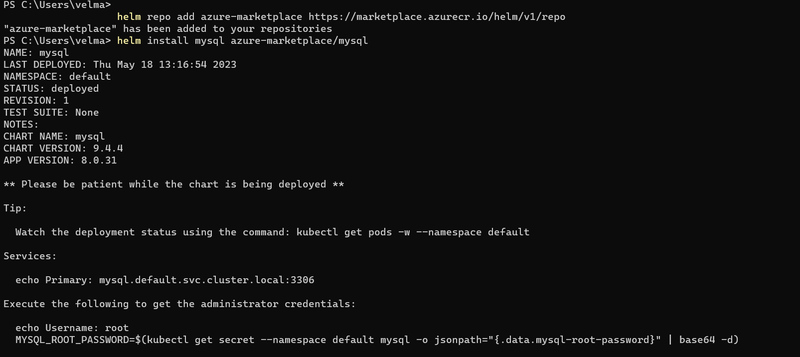
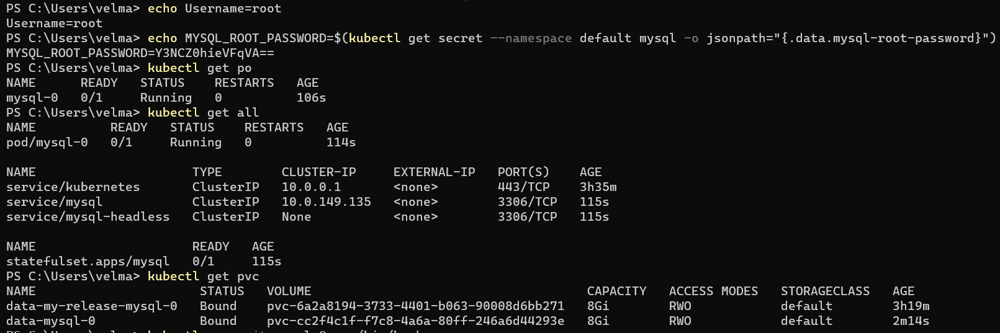
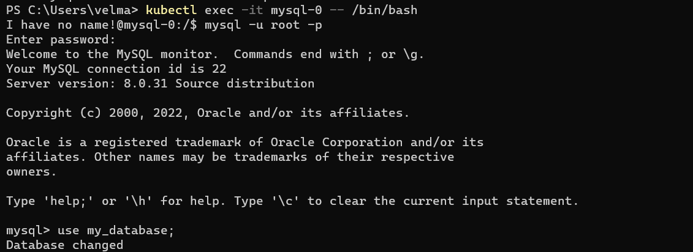
* note: we have to decode the base64 encoded password 
* To uninstall chart `helm uninstall <name>`
### 2. postgres
* To install postgres from bitnami 
* [refer][https://bitnami.com/stack/postgresql/helm]
* `helm install my-release azure-marketplace/postgresql`
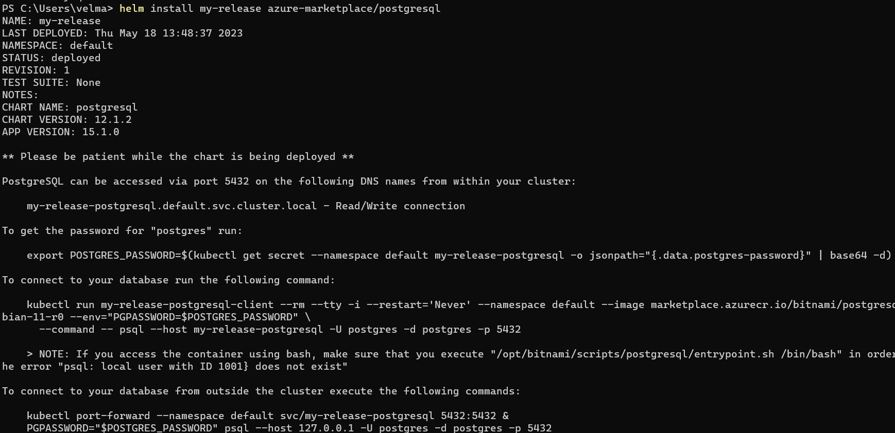
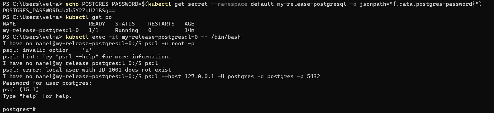
* `psql --host 127.0.0.1 -U postgres -d postgres -p 5432`
* note: we have to decode the base64 encoded password 
### 3. mongo DB
* To install helm chart of mongo DB from bitnami
* [refer][https://bitnami.com/stack/mongodb/helm]
* `helm install my-release azure-marketplace/mongodb`
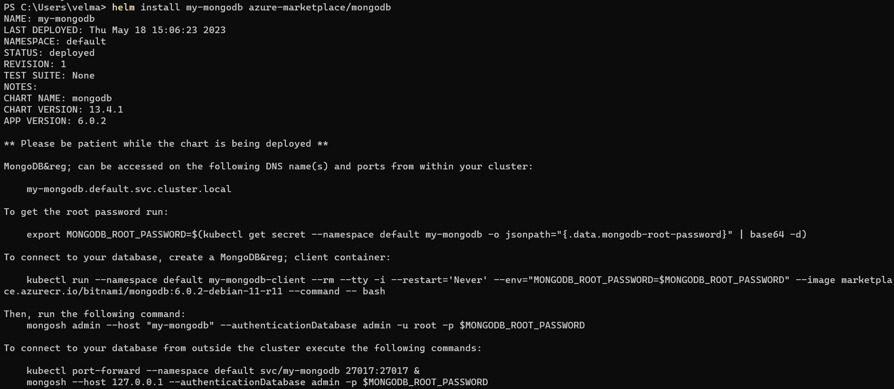
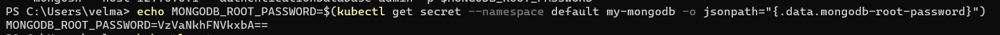
* `mongosh admin --host "my-mongodb" --authenticationDatabase admin -u root -p`
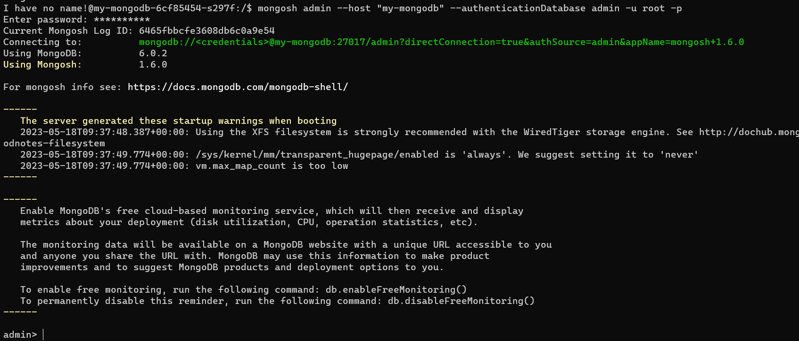
### 4. redis
* To install helm chart of redis from bitnami
* [refer][https://bitnami.com/stack/redis/helm]
* `helm install my-release azure-marketplace/redis`
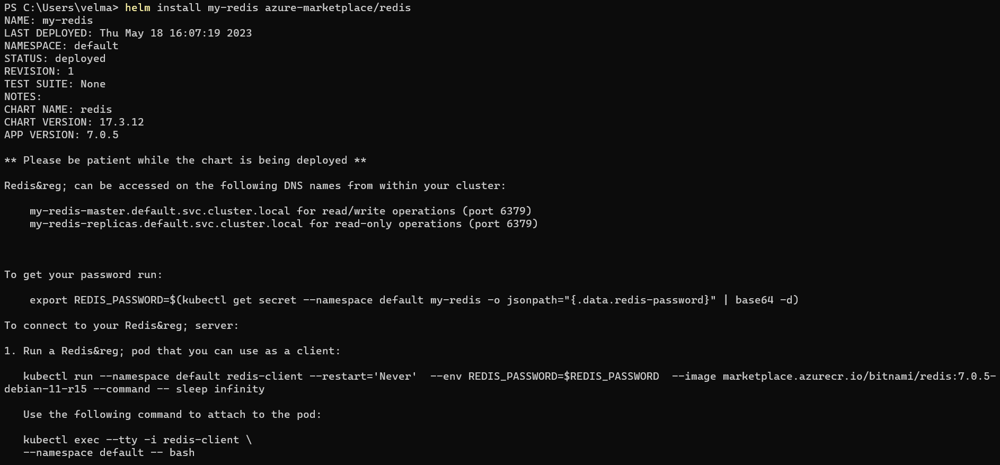
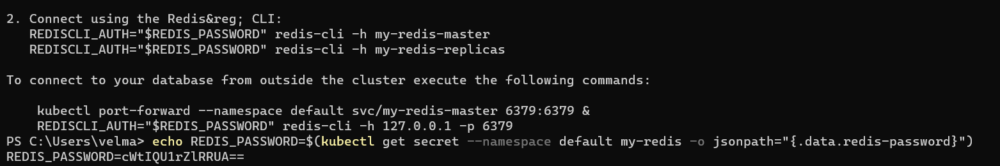
* `REDISCLI_AUTH="qkHAMkfTQP" redis-cli -h my-redis-master`
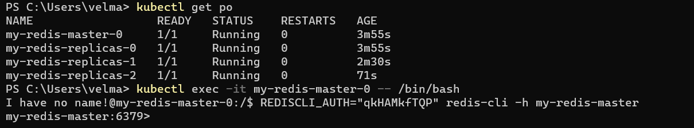
## Kustomize
* For kustomize installation [refer][https://kubectl.docs.kubernetes.io/installation/kustomize/]
* Creating kustomize file for `nopcommerce` application
* 