# Kubernetes
JOIP-25-04-2023
---------------
### Kubeadm Installation
* Create 3 vms with B2ms (2cpus/ min 4gb RAM)
* install docker 
* Run below commands as root user in all 3 vms 
* to install Container Runtime Interface - CRI-dockerd
```
###Install GO###
wget https://storage.googleapis.com/golang/getgo/installer_linux
chmod +x ./installer_linux
./installer_linux
source ~/.bash_profile
```
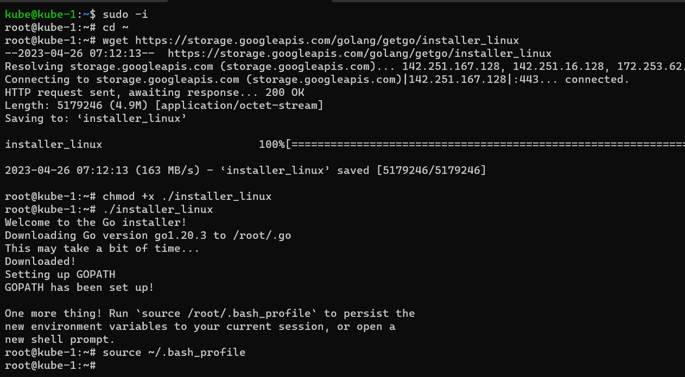
```
git clone https://github.com/Mirantis/cri-dockerd.git
cd cri-dockerd
mkdir bin
go build -o bin/cri-dockerd
mkdir -p /usr/local/bin
go build -o bin/cri-dockerd
mkdir -p /usr/local/bin
install -o root -g root -m 0755 bin/cri-dockerd /usr/local/bin/cri-dockerd
cp -a packaging/systemd/* /etc/systemd/system
sed -i -e 's,/usr/bin/cri-dockerd,/usr/local/bin/cri-dockerd,' /etc/systemd/system/cri-docker.service

systemctl daemon-reload
systemctl enable cri-docker.service
systemctl enable --now cri-docker.socket
```
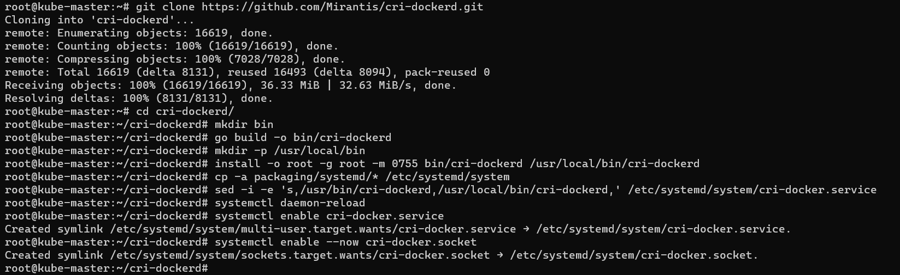
* Install `kudeadm`,`kubelet`,`kubectl` on all vms
* [refer][https://kubernetes.io/docs/setup/production-environment/tools/kubeadm/install-kubeadm/#installing-kubeadm-kubelet-and-kubectl]
```
sudo apt-get update
sudo apt-get install -y apt-transport-https ca-certificates curl

sudo curl -fsSLo /etc/apt/keyrings/kubernetes-archive-keyring.gpg https://packages.cloud.google.com/apt/doc/apt-key.gpg

echo "deb [signed-by=/etc/apt/keyrings/kubernetes-archive-keyring.gpg] https://apt.kubernetes.io/ kubernetes-xenial main" | sudo tee /etc/apt/sources.list.d/kubernetes.list

sudo apt-get update
sudo apt-get install -y kubelet kubeadm kubectl
sudo apt-mark hold kubelet kubeadm kubectl
```
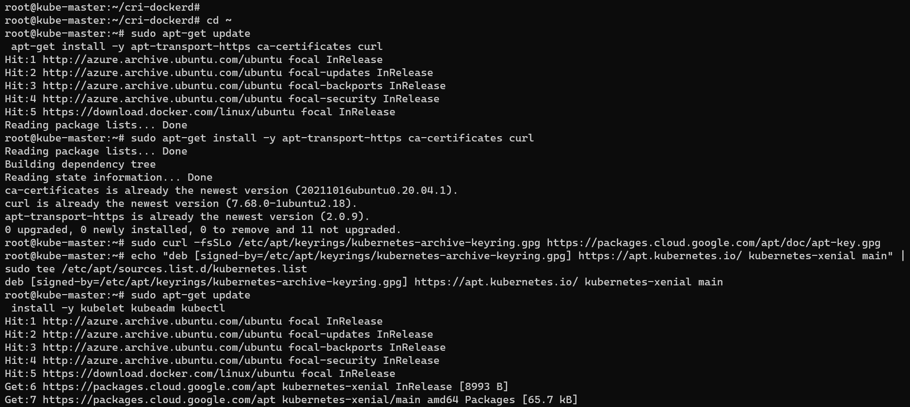
* Now Create a cluster from master node
* to create a cluster we should use `kudeadm init`
* here normally in k8s by default network will not be created
* network creation will be by thirdparty like flunnel
* to use flunnel we should define `--pod-network-cidr` 
* here we will get 2 containerd sock - `containerd sock` & `cri-dockerd`
* so we have use  `--cri-socket` option to twll which one to use
* [refer][https://kubernetes.io/docs/setup/production-environment/tools/kubeadm/create-cluster-kubeadm/]
* [refer][https://github.com/flannel-io/flannel] 
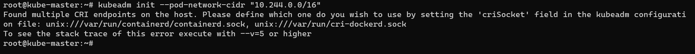
```
 kubeadm init --pod-network-cidr "10.244.0.0/16" --cri-socket unix:///var/run/cri-dockerd.sock
```
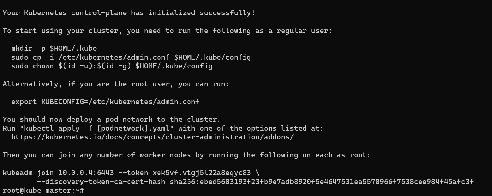
```
To start using your cluster, you need to run the following as a regular user:

  mkdir -p $HOME/.kube
  sudo cp -i /etc/kubernetes/admin.conf $HOME/.kube/config
  sudo chown $(id -u):$(id -g) $HOME/.kube/config

Alternatively, if you are the root user, you can run:

  export KUBECONFIG=/etc/kubernetes/admin.conf

You should now deploy a pod network to the cluster.
Run "kubectl apply -f [podnetwork].yaml" with one of the options listed at:
  https://kubernetes.io/docs/concepts/cluster-administration/addons/

Then you can join any number of worker nodes by running the following on each as root:

kubeadm join 10.0.0.4:6443 --token xek5vf.vtgj5l22a8eqyc83 \
        --cri-socket "unix:///var/run/cri-dockerd.sock" \
        --discovery-token-ca-cert-hash sha256:ebed5603193f23fb9e7adb8920f5e4647531ea5570966f7538cee984f45afc3f


```
* to start cluster we have run above commands, then
* Now also we will not get cluster running,because of network policy not setup
* we have install flannel also
* to install flannel `kubectl apply -f https://github.com/flannel-io/flannel/releases/latest/download/kube-flannel.yml`
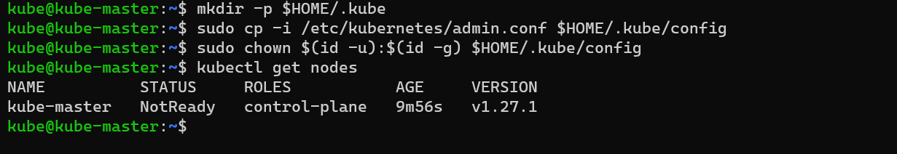
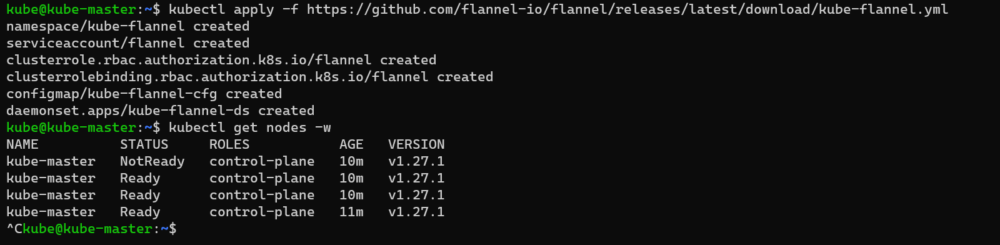
* so now master node is ready, we should add nodes to this
* to add nodes from we will get command
```
kubeadm join 10.0.0.4:6443 --token xek5vf.vtgj5l22a8eqyc83 \
        --cri-socket "unix:///var/run/cri-dockerd.sock" \
        --discovery-token-ca-cert-hash sha256:ebed5603193f23fb9e7adb8920f5e4647531ea5570966f7538cee984f45afc3f
```
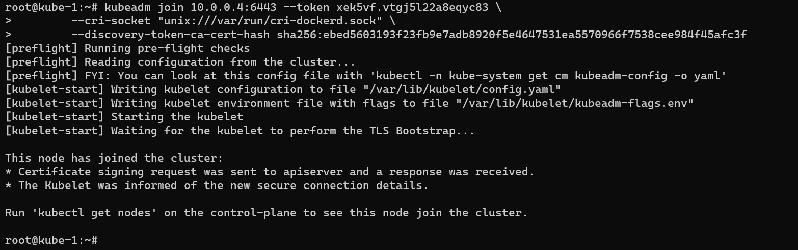
* to get nodes `kubectl get nodes`
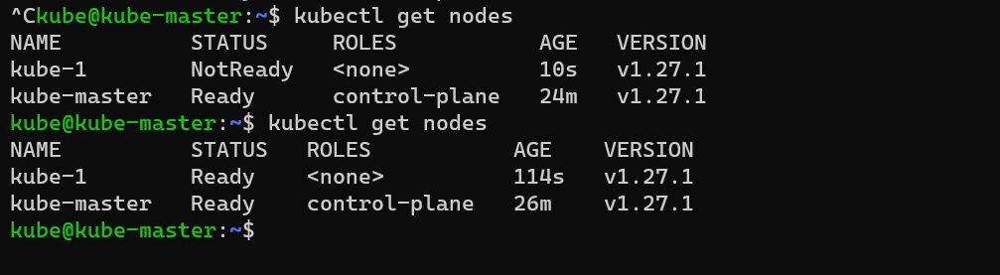

JOIP-26-04-2023
---------------
#### podspec -spc
* YAML file for spring-petclinic
```yaml
---
apiVersion: v1
kind: Pod
metadata: 
  name: spc-pod
spec:
  containers:
    - name: spc-pod
      image: srikanthvelma/spc:v1.0
      ports:
        - containerPort: 8080
``` 
```
kubectl apply -f spc.yaml
kubectl get pods -o wide
kubectl describe pods <pod name>
```
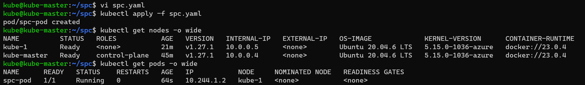
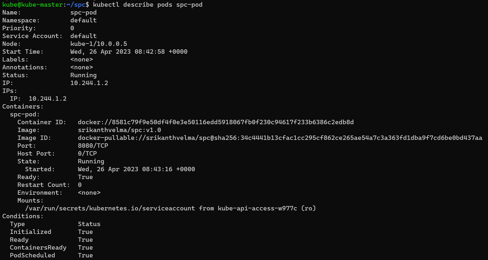

#### podspce - nopcommerce
* YAML filr nopcommerce
```yaml
---
apiVersion: v1
kind: Pod
metadata: 
  name: nop-pod
spec:
  containers:
    - name: nop-pod
      image: srikanthvelma/nopcommerce:v1.0
      ports:
        - containerPort: 5000
```
```
kubectl apply -f nop.yaml
kubectl get pods -o wide
kubectl describe pods <pod name>
```
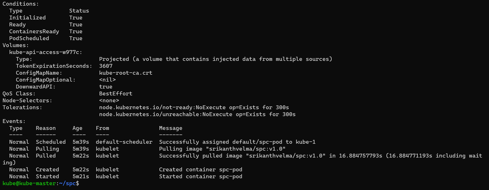
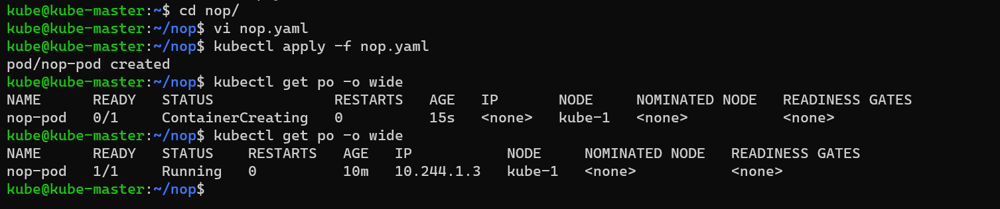


