JOIP-27-04-2023
----------------
## Kubernetes Architecture
* A kubernetes cluster consists of a set of worker machines, called as `nodes`, that runs containerized applications
* The control plane manages the worker nodes and the pods in the cluster
* Kubernetes will two major components
    * Control Plane
    * node
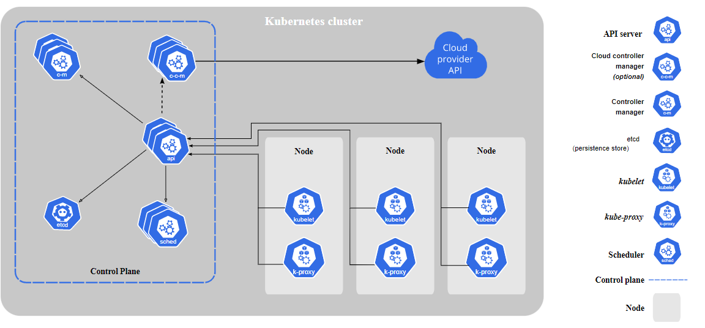
### Control Plane Components
* The control plane components make global decisions about the cluster like -scheduling, storage,controlling.
* as well as detecting and responding to cluster events - ex: starting a new pod when deployment replicas field is unsatisfied
#### Kube-apiserver (communication)
* The API server is a component of the Kubernetes control plane that exposes the Kubernetes API
* The API server is the front end for the Kubernetes control plane.
* This component is Central to Kubernetes. All communications between all components goes through the kube-apiserver
* We would interact with this component using kubectl by using the YAML files, which are also referred as manifests
* we can also scale kube-apiserver horizontally
#### etcd
* etcd stores the entire configuration and the state of the cluster.
* Consistent and highly-avai
* lable key value store used as Kubernetes' backing store for all cluster data.
#### Kube-Scheduler
* scheduler watches for the newly created pods (no node is assigned) and will assign to a healthy node
#### Kube-Control Manager
* Control plane component that runs controller processes.
* it is responsible to maintain the desired state
* Logically, each controller is a separate process, but to reduce complexity, they are all compiled into a single binary and run in a single process.
* some controllers are
    * Node controller: Responsible for noticing and responding when nodes go down
    * Job controller: Watches for Job objects that represent one-off tasks, then creates Pods to run those tasks to completion.
    * EndpointSlice controller: Populates EndpointSlice objects (to provide a link between Services and Pods)
    * ServiceAccount controller: Create default ServiceAccounts for new namespaces
#### Cloud-Control Manager
*  The cloud controller manager lets you link your cluster into your cloud provider's API, and separates out the components that interact with that cloud platform from components that only interact with your cluster.
*  The cloud-controller-manager only runs controllers that are specific to your cloud provider.
*  If you are running Kubernetes on your own premises, or in a learning environment inside your own PC, the cluster does not have a cloud controller manager.
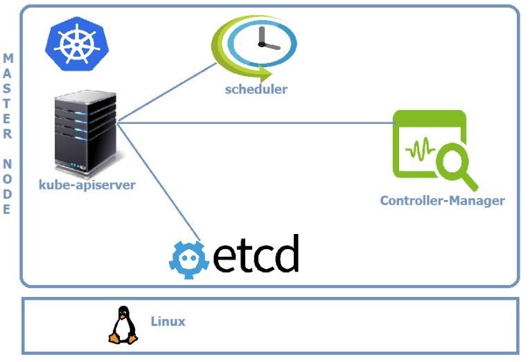
### Node Components
* Node components run on every node, maintaining running pods and providing the Kubernetes runtime environment.
#### kubelet
* An agent that runs on each node in the cluster. It makes sure that containers are running in a Pod
* It watches for the instructions from API Server for new work assignments
* If it can’t run the task assigned, it reports back to master and lets control plane decide on the actions.
* It is responsible for the node registration process
* The kubelet doesn't manage containers which were not created by Kubernetes
#### Kube-Proxy
* kube-proxy is a network proxy that runs on each node in your cluster, implementing part of the Kubernetes Service concept.
* kube-proxy maintains network rules on nodes
* These network rules allow network communication to your Pods from network sessions inside or outside of your cluster.
#### Container Runtime
* The container runtime is the software that is responsible for running containers
* Kubernetes supports container runtimes such as containerd, CRI-O, and any other implementation of the Kubernetes CRI (Container Runtime Interface)
* Container technology to be used in k8s cluster
* we will use docker container technology
  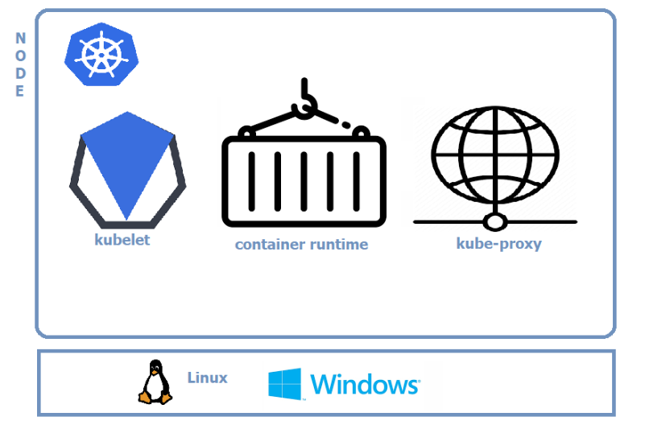
### Setup k8s on minikube
* Install Docker 
* next intall minikube [refer][https://minikube.sigs.k8s.io/docs/start/]
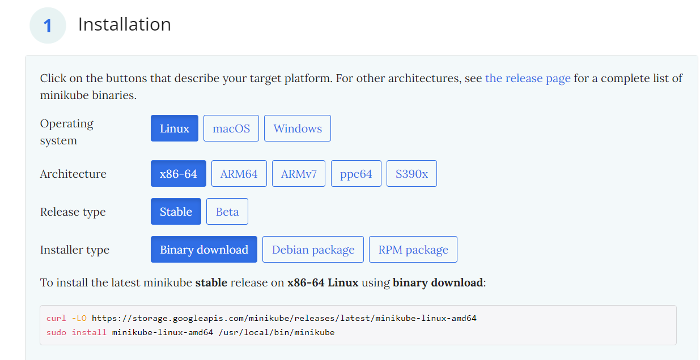
```
curl -LO https://storage.googleapis.com/minikube/releases/latest/minikube-linux-amd64
sudo install minikube-linux-amd64 /usr/local/bin/minikube
```
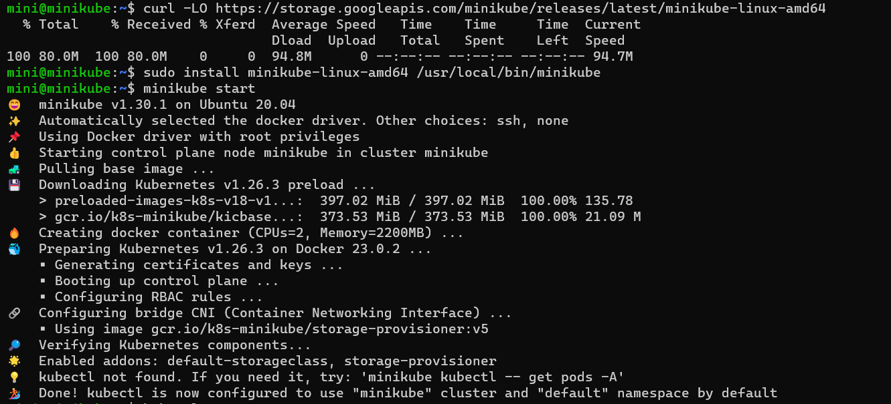
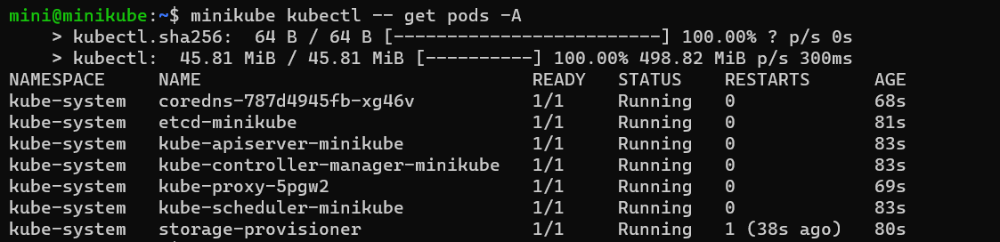
```
minikube start
minikube kubectl -- apply -f spc.yaml
minikube kubectl -- get pods -o wide
```
* if we install kubectl we can directly use kubectl commnads
* we can also minikube as prefix `minikube kubectl --` , after this we can give kubectl commands
* we can also define alias as `alias kubectl="minikube kubectl --"`
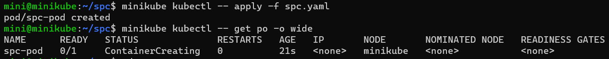
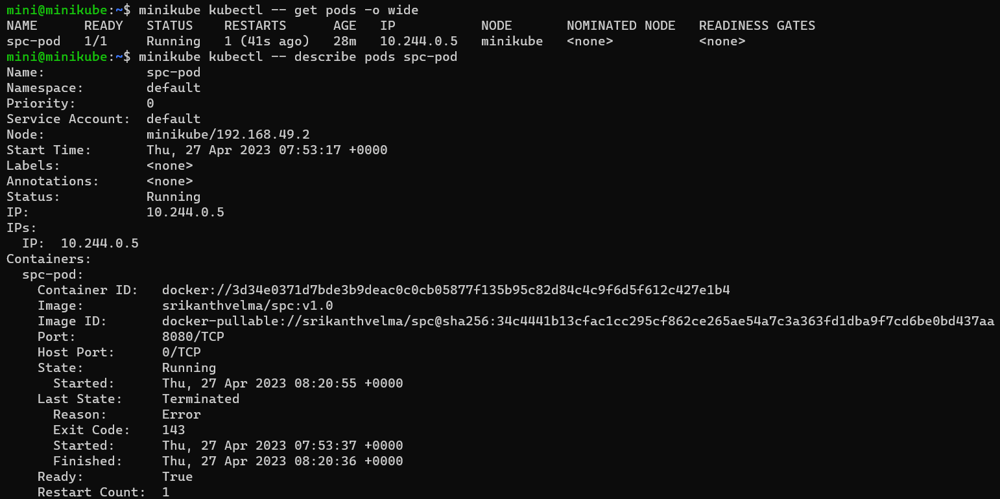


### setup k8s by kind
* install docker
* install kubectl
* intall `kind` by following commands
```
curl -Lo ./kind https://kind.sigs.k8s.io/dl/v0.18.0/kind-linux-amd64
chmod +x ./kind
sudo mv ./kind /usr/local/bin/kind
```
* to create cluster `kind create cluster`
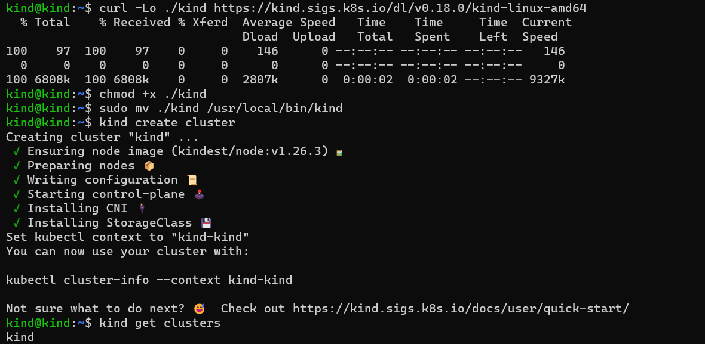
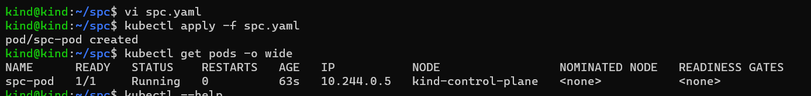
```
kubectl port-forward --address "0.0.0.0" <pod name> <pod port>:<app port>
```
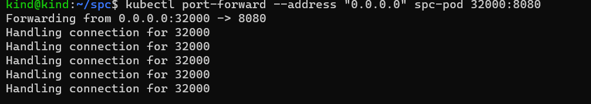
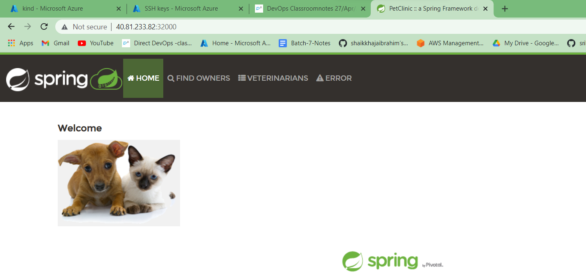
