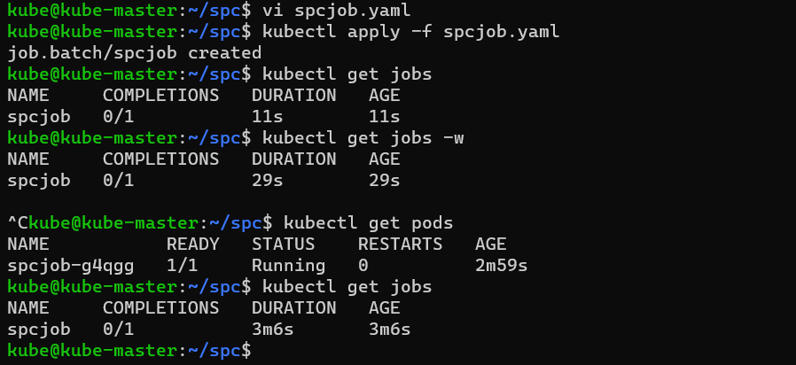
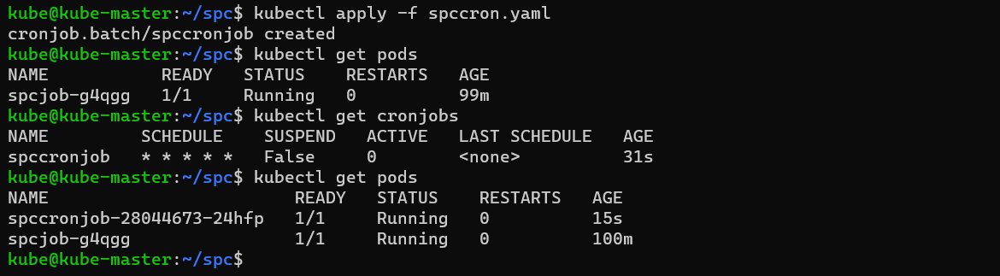
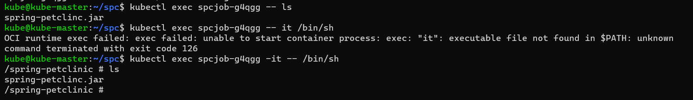

Controllers in k8s
------------------
* controllers are k8s objects which run other k8s resources
* This resources will be part of specification generally in template section
* controllers maintain desired state.
* some controllers are
    * Replication controller/Replica set
    * Jobs
    * Cron jobs
    * Stateful sets
    * Deployments
    * Daemonset
### k8s Jobs
* K8s has two types of jobs
    * Job: Run an activity/script to completion
    * CronJob: Run an activity/script to completion at specific time period or intervals.
#### Jobs
```yaml
---
apiVersion: batch/v1
kind: Job
metadata: 
  name: spcjob
spec:
  template:
    metadata:
      name: spc-pod
    spec:
      restartPolicy: OnFailure
      containers:
        - name: spc-cntr
          image: srikanthvelma/spc:v1.0
          ports:
            - containerPort: 8080        
```

#### CronJob
```yaml
---
apiVersion: batch/v1
kind: CronJob
metadata: 
  name: spccronjob
spec:
  schedule: '* * * * *'
  jobTemplate:
    metadata: 
      name: spcjob
    spec:
      template:
        metadata:
          name: spc-pod
        spec:
          restartPolicy: OnFailure
          containers:
            - name: spc-cntr
              image: srikanthvelma/spc:v1.0
              ports:
                - containerPort: 8080 
```

* to execute commands in pod
```
kubectl exec <pod name> -- <command>
kubectl exec <pod name> -it -- /bin/sh
```

### Replica set
* ReplicaSet is controller which maintains count of Pods as Desired State
```yaml
---
apiVersion: apps/v1
kind: ReplicaSet
metadata:
  name: rs-spc
spec:
  minReadySeconds: 2
  replicas: 3
  selector:
    matchLabels:
      app: spc
  template:
    metadata:
      name: spc-pod
      labels: 
        app: spc
    spec:
      containers:
        - name: spc-cntr
          image: srikanthvelma/spc:v1.0
          ports:
            - containerPort: 8080
```
