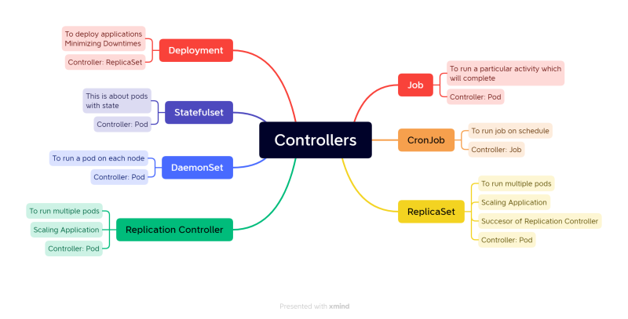

Kubernetes Concepts Preparation
-------------------------------
### Need for k8s
* High Avalbility (HA)
  * When we run applications in docker containers,if the container fails,
    we need to start manually
  * if node itself fails, all containers running on that m/c shuld be recreated on another machins
  * the above can achieved by k8s
* Auto Scaling
  * container scaling both horizontal and vertical can be done by k8s
* Zero Down time deployments
  * k8s can handle `Zero down time deployments`, `rollout & roll back`
* k8s is described as `production grade Container management`
### History
* Google had history of running applications on containers
* to handle containers they developed mgmt tools -`Borg` & `Omega`
* google has started project called kubernetes nad then handed over to `CNCF` 
* `CNCF` - `Cloud Native Container Foundation`
### Terms
* **Distributed System**:- distributed system is a collection of independent components located on different machines that share messages with each other in order to achieve common goals.
* **Node**:- A Node is a worker machine in Kubernetes and may be either a virtual or a physical machine, depending on the cluster, Each Node is managed by the control plane. A Node can have multiple pods, and the Kubernetes control plane automatically handles scheduling the pods across the Nodes in the cluster. 
* **Cluster**:- A Kubernetes (K8s) cluster is a grouping of nodes that run containerized apps in an efficient, automated, distributed, and scalable manner. K8s clusters allow engineers to orchestrate and monitor containers across multiple physical, virtual, and cloud servers.
* **State**:- There are three possible container states: Waiting , Running , and Terminated . To check the state of a Pod's containers, you can use kubectl describe pod <name-of-pod> 
* **Stateful Applications**:- A stateful app is a program that saves client data from the activities of one session for use in the next session. The data that is saved is called the application’s state. here the client data will be stored in locally
* **Stateless Applicaions**:- A stateless app will store its client data in other server like db server
* **Monolith**:- a monolithic application describes a single-tiered software application in which the user interface and data access code are combined into a single program from a single platform. A monolithic application is self-contained and independent from other computing applications.
* **Microservices**:- microservices architecture is a collection of smaller, independently deployable services.
* **Desired State**:-
* **Declarative vs Imperative**:-
* **Pet Vs Cattle**:-
### K8S Architecture
#### Control Plane Components
  * `kube-api sever`: all communication of k8s cluster,Internal or external and exposes functionalityover http protocol
  * `etcd`: memory of k8s cluster
  * `kube scheduler`: Creating k8s objects and scheduling on right node
  * `controller manager`: Responsible for Desired state, if not do the neccessary steps
  * `cloud controller manager`: 
#### Node Components
  * `kubelet`: an agent of control,plane on node
  * `kube-proxy`: Responsible for Networking for containers on node
  * `Container Run time`: container technology to be used in k8s (docker - cri dockerd)
* `kubectl`: command line interface for k8s
* `kubernetes api-resources`: all objects which can be created by k8s
* `workloads`:
  * pods
  * jobs
  * cron jobs
  * service
  * replica set
  * replication controller
  * stateful set
  * daemon set
  * deployment 
### Pods
* The smallest unit of creation of k8s
* primitive of k8s
* Pod will have Containers  -- single or multiple
* Every Pod will gets an ip address 
* Pod gets assigned to node
* we can create resources by 2 ways
  * Imperative : telling what exactly to do step by step
  * Declarative: telling only desired state-- manifest files
* **Container state**: `waiting`,`Running`&`Terminated`
* **Container Restart Policy**
    * always
    * on failure
    * never
### Controllers
* Controllers are k8s objects which runs on other resources of k8s
* Controllers maintain Desired state
* some controllers are
  * Relipcation controllers/ Replica set
  * Jobs
  * Cron jobs
  * Stateful sets
  * Daemon set
  * Deployments

### K8s Jobs
* Jobs
  * A Job will run a script / perform a given task and once it is completed, it will stop the process and runs only when it needed
  * **Ex**: to run backup before the running app
```yaml
---
apiVersion: batch/v1
kind: Job
metadata:
  name: hellojob
spec:
  template:
    metadata:
      name: jobpod
    spec:
      containers:
        - image: alpine
          command:
            - sleep
            - 10s
```
* Cron Job
  * A Cron JOb run a script /perform a task at a given schedule or given intrvals
  * **Ex:** scheduling a task to run every hour or run at 6 am daily
```yaml
---
apiVersion: batch/v1
kind: CronJob
metadata:
  name: periodicjob
spec:
  schedule: '* * * * *' 
  jobTemplate:
    metadata:
      name: getlivedata
    spec:
      template:
        metadata:
          name: livedatapod
        spec:
          containers:
            - name: alpine
              image: alpine
              command:
                - sleep
                - 3s
```
* A Job restart policy cannot be `Always` as job will never finish
* Jobs will Have `backoffLimit` to limit the no of restarts
* Jobs will `activeDeadLine` seconds to limit the time period of execution
### Replica Set
* A Replica sets purpose is to maintain stable set of replica pods at a given time
* it is often used to guarantee that the availbility of a spcified number of identical pods
* A Replica set is defined by the following fields
  * Selector: specifies how to identify the pods which it can acquire 
  * No of replicas: indicates how many pods it should maintain
  * Pod template: specifies Data of new pods it should create
* We can increase (scale out) as well decrease (scale in) the replica count
* Deployment is a higher-level concept that manages ReplicaSets and provides declarative updates to Pods along with a lot of other useful features
```yaml
---
apiVersion: apps/v1
kind: ReplicaSet
metadata: 
  name:            # RS name
  labels:          # labels for RS
spec:              # RS spec
  minReadySeconds:
  replicas:
  selector:        # we can use 2 types - equality and set based
    matchExpressions:    # set based
      - key:
        operator:
        values:
    # we can equality based
    matchLabels:
      app: nginx          # we can write any key value pair
  template:               # pod template
    metadata:             # pod metadata
      name:               # pod name
      labels:             # labels for pod
        app: nginx        # examples key value pair
    spec:                 # pod spec
      containers:
        - name:           # container name
          image:          
          ports:
            - containerPort:      # application port
```


     