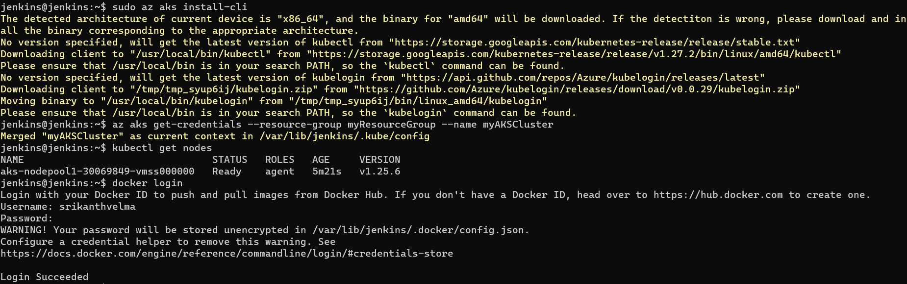
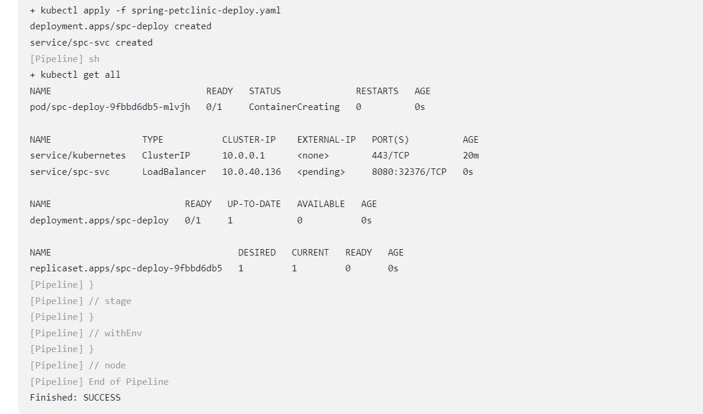
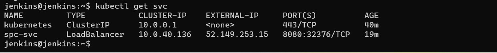
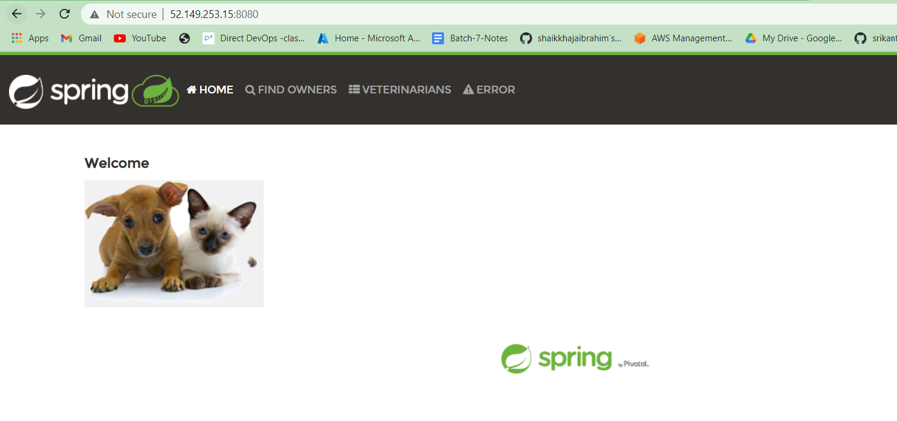

AKS Cluster Creation 
--------------------
* create a resource group
* create AKS cluster
* connect to cluster by installing `kubectl`
* config `kubectl`
```
az group create --name myResourceGroup --location eastus
az aks create -g myResourceGroup -n myAKSCluster --enable-managed-identity --node-count 1 --enable-addons monitoring --enable-msi-auth-for-monitoring  --generate-ssh-keys

az aks install-cli
az aks get-credentials --resource-group myResourceGroup --name myAKSCluster
```
Topics In Kubernetes
--------------------
1. History and Architecture
2. kubernetes Installation
   1. kubeadm
   2. minikube
   3. kind
3. objects, api-resoureces & work loads
4. Pods
   1. pods creation 
      1. imperative
      2. declarative - manifest file
   2. pod spec & restart policy
5. Controllers 
6. pod spec
7. jobs and cron jobs
8. replics set spec
9. replication controller
10. labels and selector
11. kubernetes as a service - AKS , EKS
    1.  AKS cluster Creation
12. service spec
    1.  Internal
    2.  External
13. Health checks/probes
    1.  liveness probe
    2.  readiness probe
    3.  startuo probe
14. Resource Mgmt - Pods and Containers
    1.  Requests and limits -CPU/Memory
15. Container types in Pods
    1.  Containers
    2.  init containers
    3.  ephemeral containers
16. Deployment
    1.  rolling out
    2.  rolling back
17. Annotations
    1.  change cause
18. Daemon set
19. Scheduling Pods
    1.  node selector
    2.  affinity
    3.  taints and tolerations
20. Headless service
21. Storage in k8s
    1.  volumes 
22. stateful sets


## Deployment to AKS cluster
* create a vm and install 
    * Jenkins (java for jenkins)
    * Docker
    * Azure cli and `az login` to configure account
* Create a kubernetes AKS cluster
* Configure this AKS cluster in the jenkins server
```sh
sudo az aks install-cli
az aks get-credentials --resource-group myResourceGroup --name myAKSCluster
```
* it will copy `.kube/config` to home directory of respective user
* we can install above things in `jenkins` user also
* if we install and configure everything in `jenkins` user then no need to write or configure in jenkins UI.
* so here i have created a password for jenkins user
* and also added in sudoers file with `NOPASSWD:ALL`
* and installed following from jenkins user
  * docker
  * docker login
  * azure cli and az login
  * Configure aks cluster and credentials

* Install Docker and Docker pipeline Plugins in Jenkins UI
* Jenkinsfile
```groovy
pipeline{
    agent 'any'
    triggers{ pollSCM('* * * * *') }
    // environment{
    //     DOCKERHUB_CREDENTIALS = credentials('docker-cred')
    // }
    stages{
        stage("VCS"){
            steps{
                git url: 'https://github.com/Jenkins-projects57/spring-petclinic-cicd.git',
                    branch: 'main'
            }
        }
        stage("BUILD"){
            steps{
                sh './mvnw package'
            }
        }
        stage("JUNIT"){
            steps{
                archiveArtifacts artifacts: '**/target/spring-petclinic-3.0.0-SNAPSHOT.jar'
                junit '**/surefire-reports/TEST-*.xml'
            }
        }
        stage("Docker BUILD & PUSH"){
            steps{
                // sh 'echo $DOCKERHUB_CREDENTIALS_PSW | docker login -u $DOCKERHUB_CREDENTIALS_USR --password-stdin'
                sh 'docker image build -t spc:v2.0 .'
                sh 'docker image tag spc:v2.0 srikanthvelma/spc:latest'
                sh 'docker image tag spc:v2.0 srikanthvelma/spc:${BUILD_NUMBER}'
                sh 'docker image push srikanthvelma/spc:${BUILD_NUMBER}'
                sh 'docker image push srikanthvelma/spc:latest'
            }
        }
        stage("K8S DEPLOY"){
            steps{
                // sh 'sudo cp /home/velma/.kube/config /var/lib/jenkins/.kube/'
                // sh 'sudo chmod 777 /var/lib/jenkins/'
                // sh 'sudo chmod 777 /var/lib/jenkins/.kube/config'
                // sh 'az aks get-credentials --resource-group myResourceGroup --name myAKSCluster'
                sh 'kubectl apply -f spring-petclinic-deploy.yaml'
                sh 'kubectl get all'
            }
        }
    }
}
```
* Docker file
```Dockerfile
FROM alpine/git AS VCS
RUN cd / && git clone https://github.com/Jenkins-projects57/spring-petclinic-cicd.git

FROM maven:3.9-amazoncorretto-17 AS Builder
COPY --from=VCS /spring-petclinic-cicd /spring-petclinic
RUN cd /spring-petclinic && mvn package

FROM amazoncorretto:17-alpine-jdk
LABEL author="srikanth" org="qt" project="multistage-spc"
ARG HOME_DIR=/spring-petclinic
WORKDIR ${HOME_DIR}
COPY --from=Builder /spring-petclinic/target/spring-*.jar ${HOME_DIR}/spring-petclinc.jar
EXPOSE 8080
CMD [ "java","-jar","spring-petclinc.jar" ]
```
* kubernetes manifest file
```yaml
---
apiVersion: apps/v1
kind: Deployment
metadata: 
  name: spc-deploy
spec:
  minReadySeconds: 5
  replicas: 1
  selector:
    matchLabels:
      app: spc
  strategy:
    type: RollingUpdate
    rollingUpdate:
      maxSurge: 25%
      maxUnavailable: 25%
  template:
    metadata:
      name: spc-pod
      labels:
        app: spc
      annotations:
        CHANGE-CAUSE: for rollout testing
    spec:
      containers:
        - name: spc-ctnr
          image: srikanthvelma/spc:latest
          ports:
            - containerPort: 8080
          livenessProbe:
            exec:
              command:
              - echo
              - this is livenessProbe
            initialDelaySeconds: 5
            periodSeconds: 5
            # httpGet:
            #   path: /
            #   port: 80
            # initialDelaySeconds: 3
            # periodSeconds: 3
---
apiVersion: v1
kind: Service
metadata: 
  name: spc-svc
spec:
  type: LoadBalancer
  selector:
    app: spc
  ports:
    - name: spc-port 
      port: 8080
      targetPort: 8080
      protocol: TCP
```



